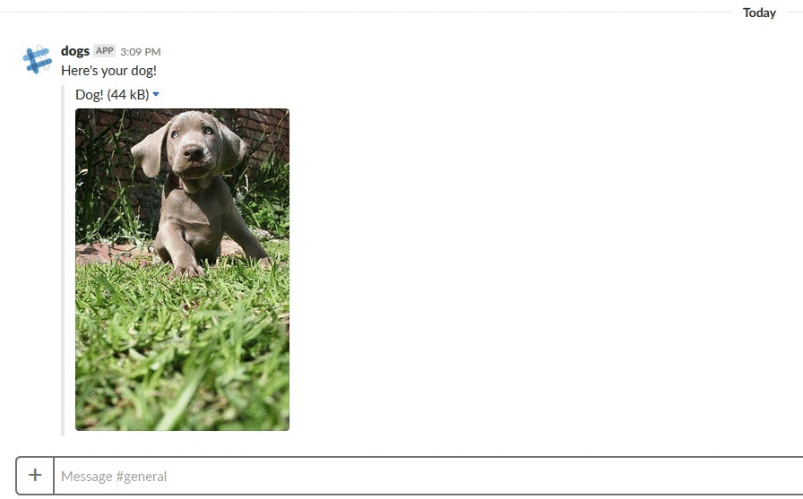

title: JVM Server Applications with Kotlin
class: animation-fade
layout: true

<!-- This slide will serve as the base layout for all your slides -->
.bottom-bar[
  {{title}}
]

---

class: impact

# {{title}}
## Alternative Title: Using JVM driven microservices to overengineer a Slack Slash Command


---

# before we get into it

--
- If you have a question, just yell at me.

--
- If I get nervous and start talking too quietly or fast, just yell at me.

--
- just yell at me.

---

# Agenda

- Rapid Prototyping functional HTTP services with HTTP4K
- Functional Domain Modeling with Kotlin
- Using Interfaces + Extension functions for Scoped Inversion of Control
- Extending Spek for ~easy~ integration tests
- Coroutines + gRPC for simple interprocess communication

---

# OK, Let's Define A Problem

--
- **Problem:** everyone in the tech industry is sad

--
- **Solution:** Build an application which can reliably deliver happiness

--
- **Happiness Domain Expert:** - A picture of a dog will inexplicably cause universal happiness 

--
- **Tech Industry Domain Expert:** - Most tech companies use Slack for communication

--

### let's engineer happiness by constructing a service which supplies random images of dogs to Slack

---

# Upon inspection of existing services

--
- Slack supports custom slash commands 

--
- A web API supporting random dog images exists: https://dog.ceo


# Perfect!!! So what do we need to build???

--
- Something to respond to a Slack webhook over HTTP

--
- Something to consume the dog.ceo API

---

# How does this slash command even work?

Via Slack API:

- Receive POST x-www-form-urlencoded
- Can either respond immediately, or POST to a URL to deliver later
- Should try to respond 200 no matter what

---

Before we do anything, let's do some domain modeling

```kotlin
data class DogImage(val url: String)

interface DogImageRetrievalService {
    suspend fun requestImage(): Try<DogImage>
}


interface ImageNotificationService {
    suspend fun notify(image: DogImage, notifyUrl: NotificationUrl): Try<Unit>
}

typealias NotificationUrl = String
```

--

## Things to note

--
- Using Arrow-KT's **Try** to aid in service composition and handle error handling gracefully

--
- Defining these functions as **suspendable** because they're hitting external services, they could take some time to execute

---

# Pretty easy to implement these guys 
# via Retrofit

```kotlin
class NotificationRetrofitService: ImageNotificationService {
    private val api: SlackResponseApi = SlackResponseApi.singleton

    suspend override fun notify(image: DogImage, notifyUrl: NotificationUrl) = Try {
        api.respond(image.toSlackMessage(), notifyUrl.getEndpoint()).await()
        Unit
    }
}

class DogRetrofitService: DogImageRetrievalService {
    private val api: DogApi = DogApi.singleton

    suspend override fun requestImage() = Try {
            val imageAsync = api.getImage()
            DogImage(imageAsync.await().message)
    }
}
```

Where *api* is the Retrofit client with the coroutines extension loaded.
 

---

Seems like we're all set. Let's build the HTTP Api

---

# Quick Look at HTTP4k

--
- "Server as a Function"

--
- Break endpoints into composable functions

```kotlin

// Define some endpoints
fun diagnostics(version: String)= routes(
        "/ping" bind GET to { request -> Response(OK).body("pong!")},
        "/version" bind GET to { request -> Response(OK).body(version)}
)


// Bind them to the /diagnostic endpoint
fun api(version: String) = routes(
        "/diagnostic" bind diagnostics(version)
)

// boot up the http server
fun main(args: Array<String>) {
	val app = api(version = "0.0.1")
	app.asServer(Jetty(8080))
		.start()
		.block()
}

```
---

# looks great
# but dependency resolution by passing function parameters
# seems untenable as my
# application gets bigger

--

### (i agree)

---

# To solve this, let's borrow someone else's work

http://www.pacoworks.com/2018/02/25/simple-dependency-injection-in-kotlin-part-1/


--
^^ Use interfaces and extension functions to create a scoped context with implicit dependencies

---

# in a nutshell

```kotlin

// instead of
class UserService(val db: Db) {
    fun save(user: User) = db.save(user)
}

// Use interface as a "context"
interface UserPersistance {
    val db: Db
    fun User.save() = db.save(this)
}
```


- Implement Interfaces to fulfill dependencies
- Compose Interfaces together to build dependency chain

---

# Rewriting the "Diagnostic" routes

```kotlin
internal interface DiagnosticApi {
	// Declaring a dependency
	// Gets "injected" when we implement the DiagnosticApi
    val applicationVersion: String

    fun Request.ping() = Response(OK).body("pong!")
    fun Request.version() = Response(OK).body(applicationVersion)
}


internal fun DiagnosticApi.diagnosticRoutes() = routes(
	// Because we're in the "context" of DiagnosticApi, we can use the extension methods dependency free
	"/ping" bind GET to { request -> request.ping() },
	"/version" bind GET to { request -> request.version() }
)

```

---

# Top level Api Interface

```kotlin

// Top level interface "implements" each other layer
internal interface Api : DiagnosticApi {
    val isDebug: Boolean
}

private fun Api.applicationRoutes() = routes(
	// We can bind diagnostic routes because Api fulfills the DiagnostApi interface
	"/diagnostic" bind diagnosticRoutes()
)

internal fun Api.routes()  = when(isDebug) {
    true -> DebuggingFilters.PrintRequestAndResponse().then(applicationRoutes())
    false -> routes(applicationRoutes())
}
```
---

# What does our Server look like now?

```kotlin
fun main(args: Array<String>) {

	// Top Level configuration
	val app = (object: Api {
		override val isDebug = true
		override val applicationVersion = "0.0.1"
	}).routes()
	
	
	app.asServer(Jetty(8080)).start().block()

}
```

---
# Alright
# let's build
# the webhook

---

```kotlin
interface SlackApi {
	// Our dependencies:
	// Something to get dog pics
    val dogRetrievalService: DogImageRetrievalService
	
	// Something to notify Slack
    val notificationService: ImageNotificationService

    fun Request.requestDogPic(): Response {
        val result = toSlackCommand()
            .map { cmd ->
				// Using launch because we don't care about the result
                launch {
                    dogRetrievalService.requestImage()
                            .sFlatMap {
                                notificationService.notify(it, cmd.response_url)
                            }
                            .recover {
                                "Webhook execution failed: ${it.message}".error()
                            }
                }
                Response(Status.OK)
            }

        return when(result) {
            is Success -> Response(Status.OK)
            is Failure -> Response(Status.BAD_REQUEST) // response_url is not present
        }
    }
}
```
---
# Let's break this down

--
- First, we house our dependencies inside the SlackApi interface

```kotlin
// Something to get dog pics
val dogRetrievalService: DogImageRetrievalService

// Something to notify Slack
val notificationService: ImageNotificationService
```

---

# We need to parse form data

```kotlin
// We only care about the response_url
data class SlackHookCmd(
        val response_url:String
)

fun Request.toSlackCommand(): Try<SlackHookCmd> = Try {
    val urlField = FormField.string().required("response_url")
	// Will throw an exception if field is not present
    val form = Body.webForm(Validator.Strict, urlField).toLens()

    val url = urlField.extract(form.extract(this))
    SlackHookCmd(
            response_url = url
    )
}
```
---

# Use Try.map to extract the parsing result
```kotlin
val result = toSlackCommand()
	.map { cmd ->
	// Using launch because we don't care about the result
		launch {
			dogRetrievalService.requestImage()
				.sFlatMap {
					notificationService.notify(it, cmd.response_url)
				}
				.recover {
					"Webhook execution failed: ${it.message}".error()
				}
			}
		Response(Status.OK)
	}
```

--
- what is a **sFlatMap**

---
# Suspendable Flat Map - composition

```kotlin
suspend fun<T, V> Try<T>.sFlatMap(block: suspend (T) -> Try<V>) = when (this) {
    is Success -> block(value)
    else -> this
}
```
--
- Chain suspendable computations together

--
- Fail fast when one item fails


---
# Finally, the return 

```kotlin
return when(result) {
	is Success -> Response(Status.OK)
	is Failure -> Response(Status.BAD_REQUEST) // response_url is not present
}
```

In this case, the BAD_REQUEST means Slack has sent something weird

Everything else is OK

---

# sick,
# let's define our Endpoint

```kotlin
fun SlackApi.slackHooks() = routes(
        "/dog" bind POST to { it.requestDogPic() }
)
```

---

# Composing our routes

```kotlin
// webhooks are housed under the V1Api
internal interface Api : DiagnosticApi, V1Api {
    val isDebug: Boolean
}

private fun Api.applicationRoutes() = routes(
        "/diagnostic" bind diagnosticRoutes(),
        "/api/v1" bind v1Routes()
)

internal fun Api.routes()  = when(isDebug) {
    true -> DebuggingFilters.PrintRequestAndResponse().then(applicationRoutes())
    false -> routes(applicationRoutes())
}
```

---

# What does our application look like now?

```kotlin
val app = (object: Api {
	override val isDebug = conf.debug

	override val applicationVersion: String = conf.version

	override val dogRetrievalService: DogImageRetrievalService = DogRetrofitService()

	override val notificationService: ImageNotificationService = RetrofitNotificationService()

}).routes()

// Start
app.asServer(Jetty(conf.http.port)).start().block()
```

---

# Taking a quick break to write some integration tests

--
- Can test each set of endpoints individually because everything is just a function

--
- Interface injection makes stubbing things easy

---

# Extending Spek

```kotlin
fun Spec.givenRoutes(routes: HttpHandler, description: String, body: SpecBody.() -> Unit) {
    var server: Http4kServer? = null

    beforeGroup {
        server = routes.asServer(Jetty(8080))
        server?.start()
    }

    afterGroup {
        server?.stop()
    }

    describe(description, body)
}
```

- Extend off Spec and SpecBody to easily create test fixtures

---

# Building the Stubbed SlackApi

```kotlin
object TestSlackApi: SlackApi {
    override val dogRetrievalService: DogImageRetrievalService = TestRetrievalService
    override val notificationService: ImageNotificationService = TestNotificationService
}

object TestRetrievalService: DogImageRetrievalService {
	// Using Try.pure to just return a value
    suspend override fun requestImage() = Try.pure(DogImage("test.jpg"))
}

object TestNotificationService: ImageNotificationService {
    suspend override fun notify(image: DogImage, notifyUrl: NotificationUrl) = Try.pure(Unit)
}
```

Could easily pull in a stubbing framework if more functionality is needed

---

# Our Tests

```kotlin
@RunWith(JUnitPlatform::class)
object SlackHooksSpek: Spek({

    givenRoutes(TestSlackApi.slackHooks(), "Slack Web Hook") {

        describe("valid request") {

            it("should return 200") {
                given()
                        .param("response_url", "http://example.org")
                        .post("/dog")
                        .then()
                        .statusCode(200)
            }
        }

        describe("invalid request") {
            it("should return 400") {
                post("/dog")
                        .then()
                        .statusCode(400)
            }
        }

    }
})
```

---



---

wow, We Have A MVP

--

### But, just for grins, let's do some overengineering

--

- Let's pretend the image retrieval is costly and is becoming a bottleneck

--
- We'll need to split it into it's own service

--
- It'd be nice if we could do that with minimal refactoring

---
# gRPC could save us

> gRPC is a modern open source high performance RPC framework that can run in any environment. It can efficiently connect services in and across data centers with pluggable support for load balancing, tracing, health checking and authentication. It is also applicable in last mile of distributed computing to connect devices, mobile applications and browsers to backend services.

--

Sounds pretty good

---

--

## Before

- Slack => API webhook => Retrieve Image via Dog API => post to Slack

--

## Now

- Slack => API webhook => Retrieve Image via gRPC service => post to Slack

---
# Three Steps to implement a gRPC service

--
1. Define a service using a proto file

--
2. Build a Server which implements the service definition

--
3. Utilize the generated Client to access the server

---
# Service Definition

```proto
syntax = "proto3";

option java_package = "zone.thedaniel.dogcam";
option java_multiple_files = true;

service DogPhotoService {
    rpc RequestPhoto(PhotoRequest) returns (PhotoResponse);
}

message PhotoRequest {}

message PhotoResponse {
    string url = 1;
}
```

--

if you squint, you may see something familiar

```kotlin
interface DogImageRetrievalService {
    suspend fun requestImage(): Try<DogImage>
}
```

---
# 1 down


1. **&#10003;** Define a service using a proto file 
2. Build a Server which implements the service definition
3. Utilize the generated Client to access the server

---
# Implement the Service Definition

Just need to implement the generated _DogPhotoService_

```kotlin
class DogFetchService: DogPhotoServiceGrpc.DogPhotoServiceImplBase() {
    override fun requestPhoto(request: PhotoRequest?, responseObserver: StreamObserver<PhotoResponse>?) {
		TODO("implement me")
    }
}
```

---
# Let's re-use some code

```kotlin
class DogFetchService(val service: DogImageRetrievalService): DogPhotoServiceGrpc.DogPhotoServiceImplBase() {
    override fun requestPhoto(request: PhotoRequest?, responseObserver: StreamObserver<PhotoResponse>?) {
        launch {
            service.requestImage()
                    .map { response ->
                        responseObserver?.run {
                            onNext(response.toPhotoResponse())
                            onCompleted()
                        }
                    }
                    .recover {
                        responseObserver?.onError(it)
                    }
        }
    }
}
```

--
The *remarkably similar* DogImageRetrievalService fits in nicely here

---

# What does our server look like?

```kotlin
interface ServerApplication {
    val port: Int

    val dogService: DogImageRetrievalService

    fun server() =
        ServerBuilder.forPort(port)
                .addService(DogFetchService(dogService))
                .build()

}

fun main(args: Array<String>) {
    "Starting grpc on ${conf.grpc.port}".info()

    val app = object : ServerApplication {
        override val port: Int = 8000
        override val dogService: DogImageRetrievalService = DogRetrofitService()
    }
    
    // Boot Grpc Server
    app.server()
            .start()
            .awaitTermination()
}

```
---
# OK Let's write some tests for this

--
- Can use Spek similar to our HTTP tests, _except_ now we're testing a gRPC server

--
- It'd be sick if we could use the generated client to test against the server

---

Extending Spek some more

```kotlin
fun Spec.givenGrpcServer(service: BindableService, description: String, 
	body: SpecBody.(channel: ManagedChannel) -> Unit) {

    var server: Server? = null

    val channel: ManagedChannel by lazy {
        ManagedChannelBuilder.forAddress("localhost", 8080)
                .usePlaintext(true)
                .build()
    }

    beforeGroup {
        val builder = ServerBuilder.forPort(8080)
                .addService(service)
        server = builder.build()
        server?.start()
    }

    afterGroup {
        channel.shutdownNow()
        server?.shutdownNow()
    }

    describe(description) {
		// Pass the channel to our operating test
        body(channel)
    }
}
```

---

# Ready to test!

```kotlin
private object StubService: DogImageRetrievalService {
    val TEST_RESPONSE = "http://example.org"
    override suspend fun requestImage() = Try.pure(DogImage(TEST_RESPONSE))
}

@RunWith(JUnitPlatform::class)
object DogFetchServiceSpek: Spek({
    givenGrpcServer(DogFetchService(StubService), "Dog Fetch Service") {channel ->
        val stub = DogPhotoServiceGrpc.newBlockingStub(channel)

        describe("requestPhoto") {
            it("should get a photo url") {
                val response = stub.requestPhoto(PhotoRequest.getDefaultInstance())
                response.url shouldEqual StubService.TEST_RESPONSE
            }
        }
    }
})
```


---
# that wasn't so bad


1. **&#10003;** Define a service using a proto file 
2. **&#10003;** Build a gRPC server which implements the service definition
3. Utilize the generated Client to access the server

---
# let's examine 
# what a client request looks like

--

Have to use bulky StreamObserver

```kotlin

fun requestPhoto(service: DogPhotoServiceGrpc.DogPhotoServiceStub) {
    service.requestPhoto(PhotoRequest.getDefaultInstance(), object: StreamObserver<PhotoResponse> {
        override fun onNext(value: PhotoResponse?) {
            TODO("not implemented")
        }

        override fun onError(t: Throwable?) {
            TODO("not implemented")
        }

        override fun onCompleted() {
            TODO("not implemented")
        }
    })
}
```

---

# It'd be nice if

--
- We could interface with this client "synchronously" using Coroutines

--
- We didn't have to clutter calling code with the useless **PhotoRequest**

--
- The gRPC client could live in our existing **DogImageRetrievalService** definition

--

Luckily, Coroutines are ready for this scenario


---
# look at suspendCoroutine

Given this "async" method that takes in some callbacks
```kotlin

fun pretendAsyncCall(onComplete: (Int) -> Unit, onError: (Throwable) -> Unit) {
	onComplete(1)
}
```

--
We can "convert" it into a suspendable function using suspendCoroutine
```kotlin
suspendCoroutine<Int> {
	pretendAsyncCall({ number -> 
		resume(number)
	}, { err -> 
		resumeWithException(err)
	})
}
```

--
With suspendCoroutine, we can convert callback-oriented async calls into suspendable functions

---

# for gRPC, we need a  Continuation 
# to be a StreamObserver

```kotlin
fun <T:Any> Continuation<T>.toSingleObserver() = object : StreamObserver<T> {
    lateinit var value: T

    override fun onNext(value: T) {
        this.value = value
    }

    override fun onError(t: Throwable?) {
        resumeWithException(t ?: IllegalStateException("GRPC Failed"))
    }

    override fun onCompleted() {
        resume(value)
    }
}
```
- Resumes the Coroutine once a result is available via onNext
- Now we're ready for suspendCoroutine to solve our problems

---
# Extend the GrpcService

```kotlin
suspend fun DogPhotoServiceGrpc.DogPhotoServiceStub.suspendRequestPhoto(
	request: PhotoRequest = PhotoRequest.getDefaultInstance()) =
        suspendCoroutine<PhotoResponse> {continuation ->
            val observer = continuation.toSingleObserver()
            requestPhoto(request, observer)
        }
```
--
Great! We can use this gRPC call like any other suspendable function

---
# fetch a wrench, do some plumbing

Now, we just have to plug our fancy gRPC client into a *DogImageRetrievalService*
--

```kotlin
class DogGrpcService(private val stub: DogPhotoServiceGrpc.DogPhotoServiceStub): DogImageRetrievalService {
    suspend override fun requestImage() = Try {
        stub.suspendRequestPhoto().toDogImage()
    }
}
```

--
OK, we've implemented a DogImageRetrievalService with a gRPC client


--
What does our HTTP API setup look like?

---
# Reconfigure the API setup

```kotlin
    // Configure gRPC
    val channel = ManagedChannelBuilder.forAddress(conf.grpc.host, conf.grpc.port)
            .usePlaintext(true)
            .build()

    // Configure Routes
    val app = (object: Api {
        override val isDebug = conf.debug

        override val applicationVersion: String = conf.version

        // Swap out our image retrieval service with our gRPC implementation
        override val dogRetrievalService: DogImageRetrievalService = 
			DogGrpcService(DogPhotoServiceGrpc.newStub(channel))

        override val notificationService: ImageNotificationService = RetrofitNotificationService()

    }).routes()

    // Start
    app.asServer(Jetty(conf.http.port)).start().block()
```	

---

# we're done!

1. **&#10003;** Define a service using a proto file 
2. **&#10003;** Build a gRPC server which implements the service definition
3. **&#10003;** Utilize the generated Client to access the server

---

Let's look back at our toolbelt

--
### Kotlin

--
- **HTTP4k**: Great for rapid prototyping and small, functional HTTP servers

--
- **Arrow-KT**: Typed FP Extensions - Helpful for functional domain modeling & error handling

--
- **Coroutines**: Asynchronous Programming that looks synchronous 

--
- **Spek**: Extendable Unit & Integration Testing

--

### Java Interop

--
- **Retrofit**: HTTP Requests

--
- **gRPC:** Interprocess Communication

--
- **Rest Assured:** Integration Testing for RESTful services

---

# ask me questions
# &nbsp;
# &nbsp;
### Sample Project Source Code: https://github.com/dbartel/dogcam
